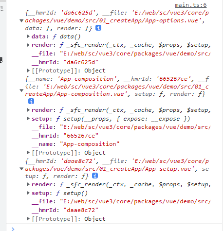
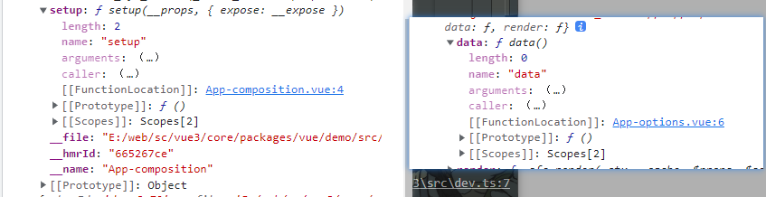
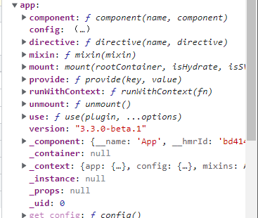
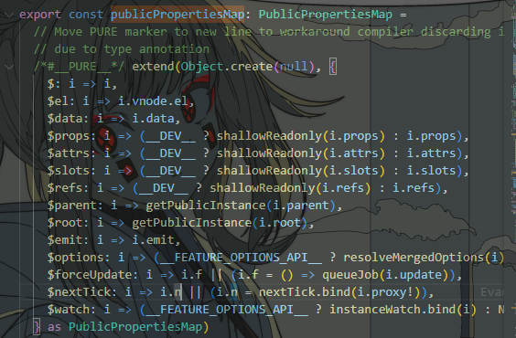

# Vue 源码解读（一）createApp

## Vue 源码结构

**version 版本 3.3.0-beta.1**

packages

```tex
├── compiler-core // 抽象语法树和渲染桥接实现的核心实现。
├── compiler-dom // 提供将模板编译成浏览器原生 DOM 元素渲染函数的实现。
├── compiler-sfc // 提供将单文件组件（Vue 单文件组件，即 .vue 文件）解析成 JavaScript 对象的实现。
├── compiler-ssr // 提供在服务端渲染 (SSR) 期间用于编译和呈现 Vue 组件的实现。
├── dts-test // 提供类型定义文件测试工具。
├── reactivity // 提供内部响应式系统的实现，支持在对象状态发生变化时，自动更新相关视图。
├── runtime-core // 提供 Vue 运行时的核心实现，包括 vnode 和 patch 等实现。
├── runtime-dom // 提供 Vue 运行时与浏览器 DOM 的交互实现。
├── runtime-test // 提供运行时测试工具。
├── server-renderer // 提供将 Vue 组件呈现为字符串的服务端渲染引擎。
├── sfc-playground // 提供单文件组件在线编辑器的实现。
├── shared  // 收集 packages 之间可共享的工具库。
├── size-check // 提供用于检查代码大小并生成历史记录的工具。
├── template-explorer // 提供用于查看和分析 Vue.js 模板的在线工具。
├── vue // 提供集成了 runtime-core 和 runtime-dom 的完整包（Vue.js）。
├── vue-compat // 提供向后兼容性支持的实现。
└── global.d.ts
```

比较核心的包:

- compiler-core
- compiler-dom
- runtime-core
- runtime-dom
- reactivity

## Vue 模板编译

在介绍 createApp 这个函数之前，我们可以先了解以下 Vue 的模板编译的结果

下面是我的目录结构


```vue
// App-options.vue 配置式Api
<template>
  <div>我是{{ name }}现在{{ age }}</div>
</template>
<script lang="ts">
export default {
  data() {
    return {
      name: "拾叁",
      age: 20,
    };
  },
};
</script>
// App-setup.vue 组合式Api语法糖
<template>
  <div>我是{{ name }}现在{{ age }}</div>
</template>
<script lang="ts" setup>
const { ref } = Vue;
const name = ref("拾叁");
const age = ref(20);
</script>
// App-composition.vue 组合式Api
<template>
  <div>我是{{ name }}现在{{ age }}</div>
</template>
<script lang="ts">
const { ref } = Vue;
export default {
  setup() {
    const name = ref("拾叁");
    const age = ref(20);
    return {
      name,
      age,
    };
  },
};
</script>
```

这三个文件被编译后的结果如下



我们可以看到组合式 Api 和响应式 Api 的 vue 单文件编译后结果其实是没有什么区别的，setup 和 data 它们的本质是一样的知识名字不一样而已。



`__file`就是当前文件的本地地址，`render`是渲染函数，本质上是调用了`/packages/compiler-sfc`将单文件组件（Vue 单文件组件，即 .vue 文件）解析成 JavaScript 对象。

下面我们就采用`setup`语法糖的文件来看看 createApp 这个函数在传入了 App.vue 单文件编译后对象后到底做了什么。

## createApp

根据断点我们可以找到`createApp`这个函数被定义在了`/packages/runtime-dom/src/index.ts`的第 65 行左右，它调用了`ensureRenderer`这个方法，`ensureRenderer`有返回了一个`createApp`方法，通过返回的`createApp`方法，再传入我们传入的`App`模板，创建好了我们的`app`应用。

```ts
// https://github.com/vuejs/core/blob/main/packages/runtime-dom/src/index.ts#L65
export const createApp = ((...args) => {
  const app = ensureRenderer().createApp(...args);
  // 这里把开发环境下的调试代码和 对 app 的 mount 方法的重写全删除了，后面会讲
  return app;
}) as CreateAppFunction<Element>;
```

### ensureRenderer 函数

这个函数的大体逻辑比较简单

```ts
// renderder是在上面定义的没有初始值
let renderer: Renderer<Element | ShadowRoot> | HydrationRenderer;
// https://github.com/vuejs/core/blob/main/packages/runtime-dom/src/index.ts#L41
function ensureRenderer() {
  // renderer 存在就返回不存在就创建一个
  return (
    renderer ||
    (renderer = createRenderer<Node, Element | ShadowRoot>(rendererOptions))
  );
}
```

`createRenderer`这个函数来自于`/packages/runtime-core`，传入的参数`rendererOptions`则是在`/packages/runtime-dom/src/index.ts`下定义好了

```ts
/*
	1.extend其实就是 Object.assign 用于合并两个对象
	2.nodeOps：存储操作和获取节点的函数的对象
	3.patchProp是一个函数，用于更新节点，因为它仅仅是一个函数，为了合并得用对象包裹
*/
const rendererOptions = /*#__PURE__*/ extend({ patchProp }, nodeOps);
```

传入了 rendererOptions 这个参数给 createRenderer 后，createRenderer 又调用了另一个函数`baseCreateRenderer`,下面是 baseCreateRenderer 的一些关键代码

```ts
// https://github.com/vuejs/core/blob/main/packages/runtime-core/src/renderer.ts#L313
/**
 * 原函数中是使用了函数重载，就两种类型，存在创建水和函数，返回水和后的renderer，
 * 不存在水和函数，返回普通renderer，我们这里的情况是没有传入创建水和函数，
 * 简单提一嘴，水和是SSR渲染的关键
 */
function baseCreateRenderer(options, createHydrationFns? = undefined) {
  // render函数的作用是将vnode(虚拟DOM节点)渲染到指定的container(真实DOM容器)中
  const render: RootRenderFunction = (vnode, container, isSVG) => {
    // 如果虚拟DOM节点为null
    if (vnode == null) {
      // 且容器上已经挂载了_vnode(之前渲染出来的虚拟DOM)
      if (container._vnode) {
        // 卸载掉之前挂载的内容，这里的unmount在baseCreateRenderer函数内，我给删掉了
        unmount(container._vnode, null, null, true);
      }
    }
    // 如果vnode不为null
    else {
      // 通过patch函数将容器上的旧的_vnode与最新的vnode进行比较
      // 如果一样就直接return，不一样就将最新的渲染到container
      patch(
        container._vnode || null,
        vnode,
        container,
        null,
        null,
        null,
        isSVG
      );
    }
    // 执行预先渲染函数队列中的函数(例如watch回调函数)
    flushPreFlushCbs();
    // 执行后置渲染函数队列中的回调函数(例如$nextTick)
    flushPostFlushCbs();
    // 更新_vnode指向
    container._vnode = vnode;
  };
  // 因为我们这里压根就没使用SSR渲染，所以下面两个都是undefined
  let hydrate: ReturnType<typeof createHydrationFunctions>[0] | undefined;
  let hydrateNode: ReturnType<typeof createHydrationFunctions>[1] | undefined;
  return {
    render,
    hydrate,
    createApp: createAppAPI(render, hydrate),
  };
}
```

### createAppAPI

这个函数是一个高阶函数，它返回我们真正的`createApp`函数

```ts
// https://github.com/vuejs/core/blob/main/packages/runtime-core/src/apiCreateApp.ts#L199
export function createAppAPI<HostElement>(
  render: RootRenderFunction<HostElement>,
  hydrate?: RootHydrateFunction
): CreateAppFunction<HostElement> {
  // 返回真正的createApp函数 参数是根组件和它的props参数没有就为null
  return function createApp(rootComponent, rootProps = null) {
    // 如果根组件是函数组件就使用extend将它放在一个对象里面
    if (!isFunction(rootComponent)) {
      rootComponent = extend({}, rootComponent)
    }
    /** 创建根组件上下文 */
    const context = createAppContext()
    const app: App = (context.app = {
        // 省略一大坨....
        // 就是app对象，mount方法就在里面
    }
    /** __COMPAT__ 是一个全局变量，用于标记是否处于兼容模式 */
    if (__COMPAT__) {
      /**
       * 在兼容模式下为app安装一些属性($attrs和$listeners)
       * 为context加入compatConfig的属性
       * 主要是为了向后兼容vue2
       */
      installAppCompatProperties(app, context, render)
    }
    return app
  }
}
```



现在我们就把 CSR(客户端渲染的 createApp 流程走通了)

### mount 方法

最后再介绍一下 app 对象里面的 mount 方法

```ts
/** 标识组件是否挂载 */
let isMounted = false
const app: App = (context.app = {
    ...
    mount(
    	rootContainer: HostElement,
        isHydrate?: boolean,
        isSVG?: boolean
    ): any {
    	// 没有挂载就创建虚拟DOM 参数是根组件和props参数(就是createApp的第二个参数)
        if (!isMounted) {
          const vnode = createVNode(
            rootComponent as ConcreteComponent,
            rootProps
          )
		vnode.appContext = context
          /** 判断是否是服务端渲染 */
          if (isHydrate && hydrate) {
            hydrate(vnode as VNode<Node, Element>, rootContainer as any)
          } else {
          /** 不是就调用render函数，这里的render函数是我们之前传入的 */
            render(vnode, rootContainer, isSVG)
          }
          /** render成功后组件挂载成功 */
    	isMounted = true
        /** 标识创建的Vue实例的根容器 */
        app._container = rootContainer
        /** __vue__app指向vue组件实例 包含虚拟DOM和其他属性比如mount unmount.... */
    	(rootContainer as any).__vue_app__ = app
    	// 返回App应用实例的应用，上面存在很多方法
    	return getExposeProxy(vnode.component!) || vnode.component!.proxy
	}
    ...
	}
})
```


