# 一个简单的 Github Action 使用教程

## 简介

- 会带你构建一个简单的个人博客？

- 使用`docusaurus` + `Github Pages` + `Github Action` + `vercel`

## 过程

1. 在合适的位置初始化`docusaurus`项目，`my-website-demo`是项目名称，可自定义

```shell
pnpm dlx create-docusaurus@latest my-website-demo classic
npx create-docusaurus@latest my-website-demo classic

cd my-website-demo
code .
```

2. 运行`pnpm start`查看效果

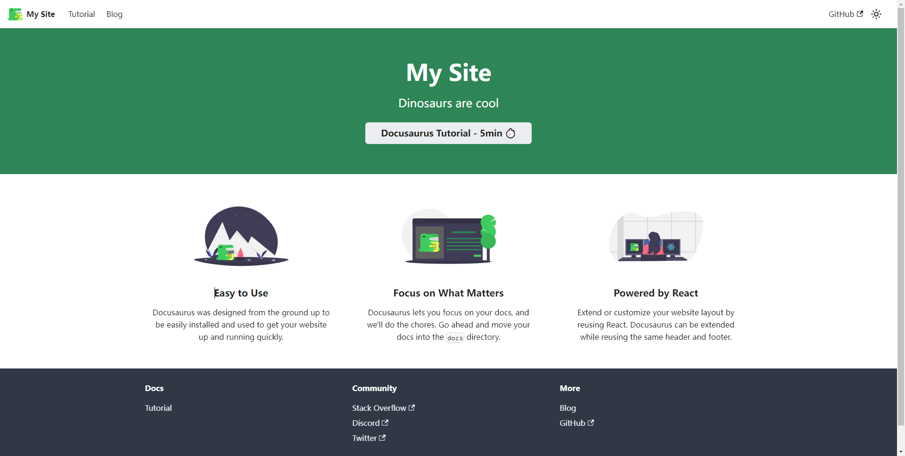

3. 将本地项目上传至`github`

这一步不需要说什么吧。

4. 创建一个自己用户名 + `.github.io`为名称的`special repository ` 来使用 `Github Pages`，比如我的 GitHub 用户名为 chovrio，那么这个仓库名就叫`chovrio.github.io`

5. 创建令牌

   1. 打开 GitHub，点击右上角自己的头像，点击 settings

   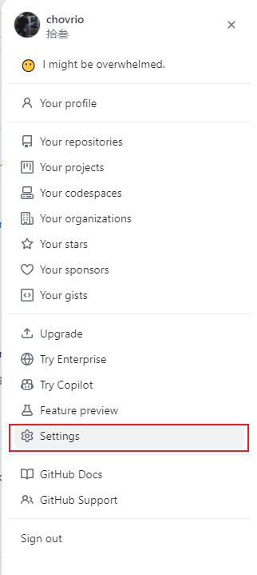

   2. 点击左下角 `developer settings`

   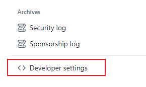

   3. 在左侧边栏中，单击 `Personal access tokens（个人访问令牌）`。

   4. 单击 `Generate new token（生成新令牌）`生成经典的 tokens，不要选择细粒化的。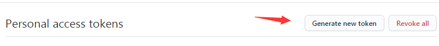

   5. 输入名称并勾选 `repo`

      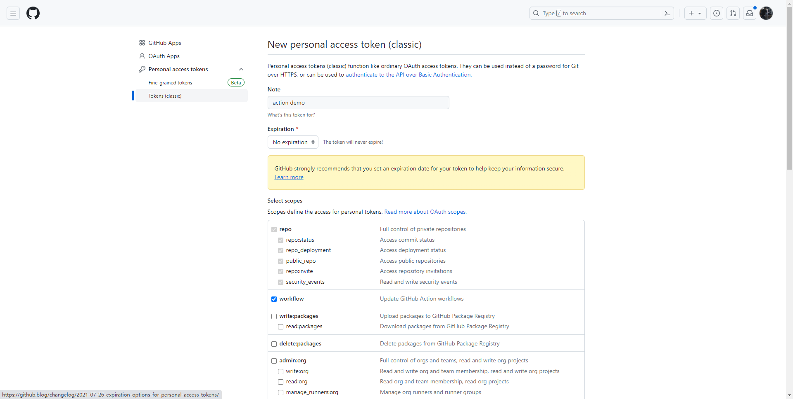

   6. 拉到最下面，点击 `Generate token`，并将生成的 token 保存起来

      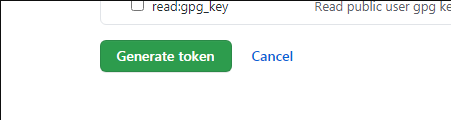

      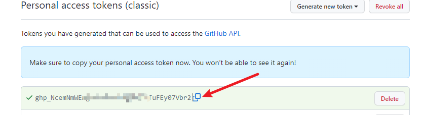

   7. 打开你的 Github 项目，点击 `settings`，点击 `Secrets and variables`->`Actions` -> `new repository secret`。

      1. 填写名称和`Secret`

      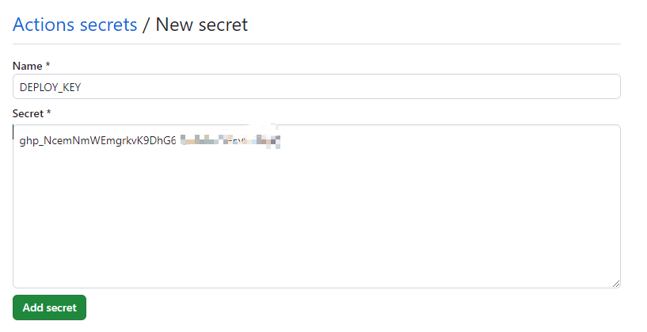

      2. 点击 `Add secret`

6. 创建新文件`my-website-demo/.github/workflows/main.yml`

- 普通版本
  - `Github Pages`不考虑部署其它静态页面，通过`https://[username].github.io/` 直接访问该页面

```yaml
# 构建的名称，随意
name: Build and Deploy
on: # 监听 main 分支上的 push 事件
  push:
    branches:
      - main
jobs:
  build-and-deploy:
    runs-on: ubuntu-latest # 构建环境使用 ubuntu
    steps:
      - name: Checkout
        uses: actions/checkout@v3
        with:
          persist-credentials: false

      - name: Install and Build # 下载依赖 打包项目
        run: |
          # 初始化docusaurus用的什么包管理工具，就保留哪一个
          # 用 npm	
          npm install
          npm run build
          # 用 pnpm
          npm install pnpm -g
          pnpm install
          pnpm run build
      - name: Deploy # 将打包内容发布到 github page
        uses: JamesIves/github-pages-deploy-action@v4 # 使用别人写好的 actions
        with: # 自定义环境变量
          token: ${{ secrets.DEPLOY_KEY }} # DEPLOY_KEY 是我的 secret 名称，需要替换成你的
          branch: main
          folder: build
          repository-name: chovrio/chovrio.github.io # 这是我的 github page 仓库
          target-folder: / # 打包的文件将放到根目录下
```

- 特殊版本

  - `Github Pages`下还想存放其它的静态页面

  ```yaml
  name: Build and Deploy
  on: # 监听 main 分支上的 push 事件
    push:
      branches:
        - main
  # 环境变量，构建时会注入 process.env.DEPLOYMENT_ENV，因为后续同时会部署在vercel上，通过这个环境变量区分 vercel 环境和 github action 环境
  env:
    DEPLOYMENT_ENV: 'chovrio.github.io'
  jobs:
    build-and-deploy:
      runs-on: ubuntu-latest # 构建环境使用 ubuntu
      steps:
        - name: Checkout
          uses: actions/checkout@v3
          with:
            persist-credentials: false

        - name: Install and Build # 下载依赖 打包项目
          run: |
            npm install
            npm run build
        - name: Deploy # 将打包内容发布到 github page
          uses: JamesIves/github-pages-deploy-action@v4 # 使用别人写好的 actions
          with: # 自定义环境变量
            token: ${{ secrets.DEPLOY_KEY }} # DEPLOY_KEY 是我的 secret 名称，需要替换成你的
            branch: main
            folder: build
            repository-name: chovrio/chovrio.github.io # 这是我的 github page 仓库
            target-folder: docusaurus-demo # 打包的文件将放到GitHub Pages的docusaurus-demo 目录下
  ```

  - 修改`docusaurus.config.js`的部分代码

  ```js
  let favicon, baseUrl;
  if (process.env.NODE_ENV === "development") {
    favicon = "img/favicon.ico";
    baseUrl = "/";
  } else {
    if (process.env.DEPLOYMENT_ENV === "chovrio.github.io") {
      favicon = "/img/favicon.ico";
      // 这个地方的 url 必须和yml文件里面的目录一样
      baseUrl = "docusaurus-demo";
    } else {
      favicon = "img/favicon.ico";
      baseUrl = "/";
    }
  }
  const config = {
      ...
      favicon,
      baseUrl,
      ...
  }
  ```

8. 提交代码到`github`仓库，在仓库的`Actions`页面可以看到构建流程。

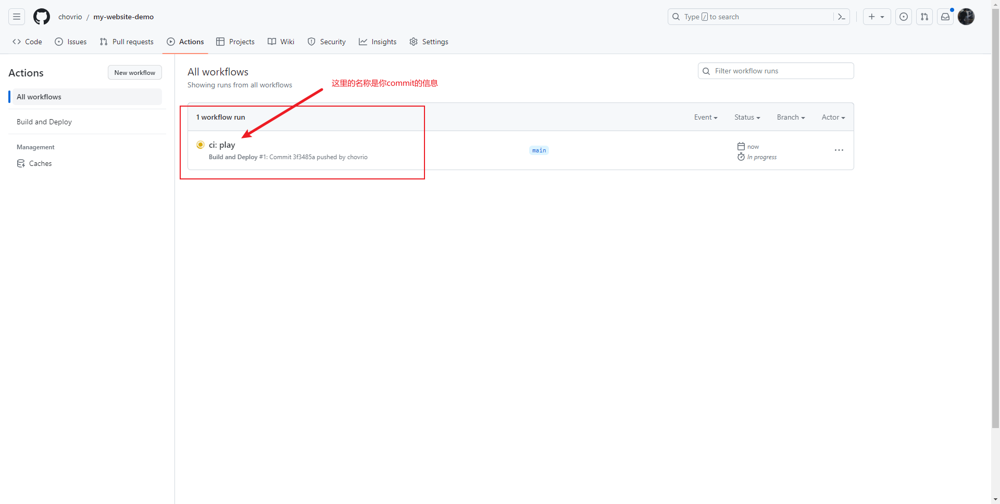

9. 跑完 ci 后，我们可以发现在自己的`Github Pages`上会出现一些代码

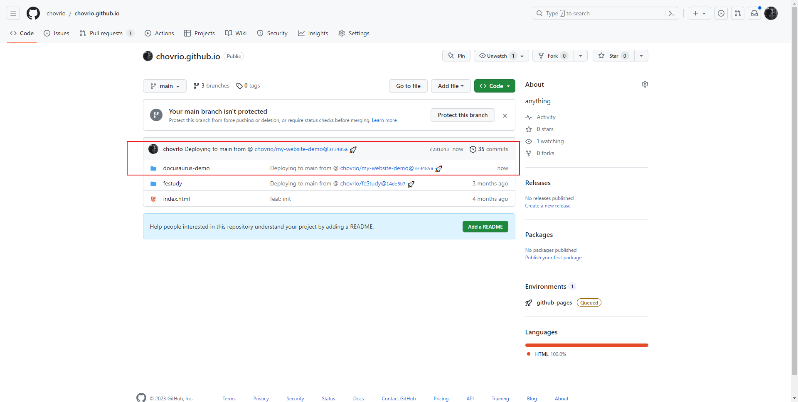

10. 此时你可以通过下面的连接访问自己的网页

    - 普通版：https://[username].github.io/
      - 特殊版本：https://[username].github.io/docusaurus-demo/

    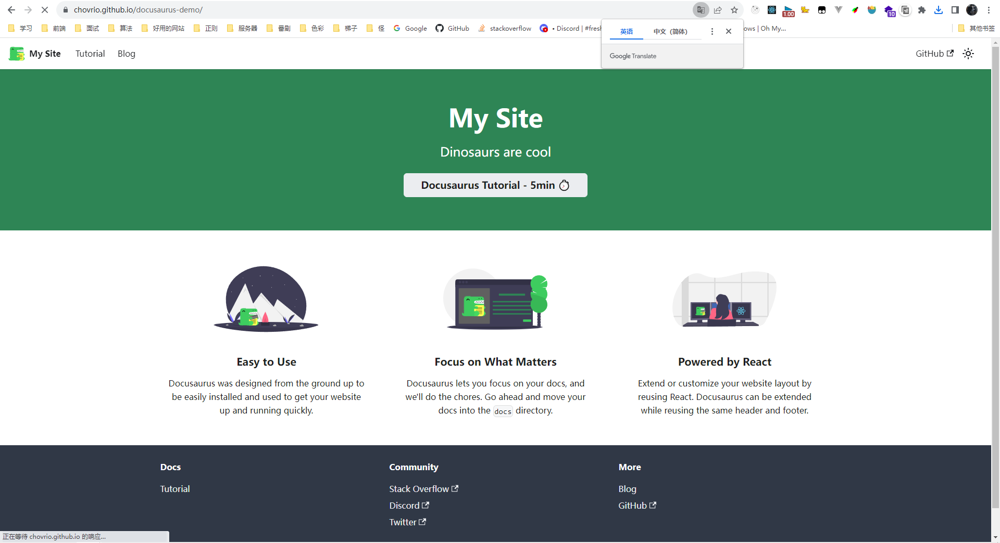

11. 我们再使用[vercel](https://vercel.com/dashboard)部署这个网站

    1. 登录后 Add new project，找到刚刚那个项目 点击 import -> Deploy
    2. 通过 vercel 部署后的网址也可以访问到我们的静态页面

    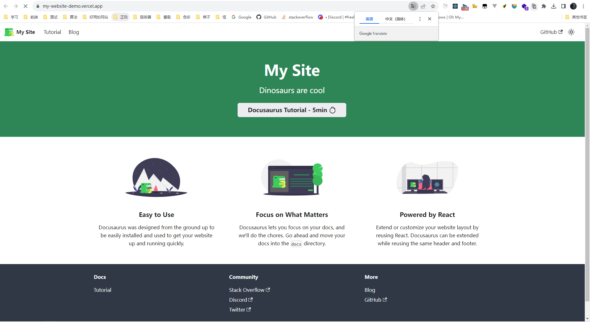

源码

[my-website-demo](https://github.com/chovrio/my-website-demo)

## 注意

[docusaurus](https://docusaurus.io/zh-CN/)是一个配置型极强的静态网站生成器，如果想要投入使用可以自己看官方文档，另外，此教程目的仅仅是一点点简单的 GitHub Actions，如果想搞个人博客，hexo，vitepress，vuepress 等等静态网站生成器都是很不错的选择，当然也可以自己手搓。
