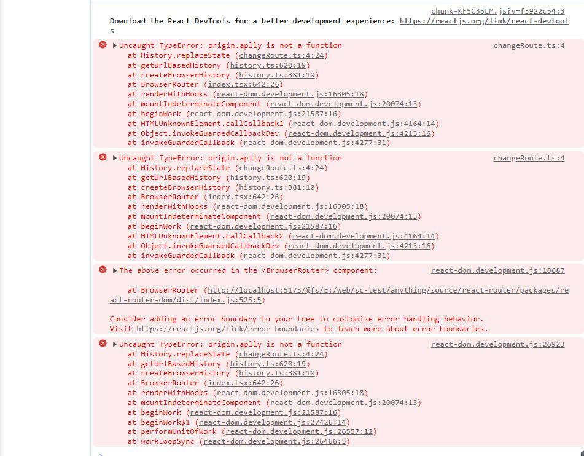
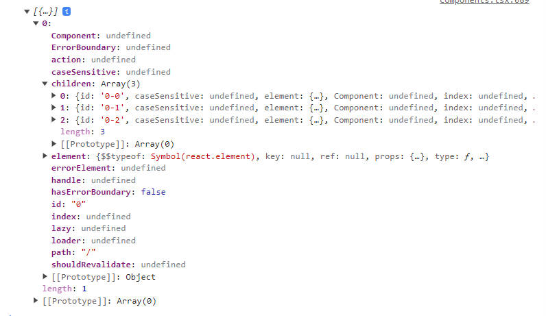

## 前言

最近在做 [monitor](https://github.com/chovrio/monitor.git) 的 `lib` 包的路由监听的时候，出现了点问题，又发现了点有意思的内容，比如 react-router 的路由底层似乎都是改写的 history Api。而不是 HashRouter 改写的 hashChange，BrowserRouter 改写 history 事件。再比如为什么我们在 `react-router` 重写 `history Api` 前，重写了原生 Api 会导致 react 应用崩溃，而我们在 react-router 改写后，再改写添加我们需要的应用逻辑就没有问题。

[源码位置](https://github.com/chovrio/anything/tree/main/packages/react-router)

小 tip：看官方文档的时候发现 react-router 更新很大，推荐我们使用 createXXX Api 来创建路由，而不是之前的 Router 组件，找到篇文章，感兴趣的可以自行阅读
[4k 字介绍 React Router 6.4 超大变化：引入 Data API。你不纯粹了！](https://cloud.tencent.com/developer/article/2246023)

我还是用的组件

## 问题再现

下面是我们改写 history api 的函数，逻辑很简单，浏览器没有提供 `pushState`和`replaceState` 的事件，但是有这两个函数，我们通过 `AOP` 思想在不影响原函数的执行效果的情况下，派发对应事件，使得我们可以监听到这两个事件

```js
export const createHistoryEvent = (type) => {
  const origin = history[type];
  return function (this, ...args) {
    const res = origin.aplly(this, args);
    const e = new Event(type);
    window.dispatchEvent(e);
    return res;
  };
};
window['trackerHistory'] = () => {
  window.history['pushState'] = createHistoryEvent('pushState');
  window.history['replaceState'] = createHistoryEvent('replaceState');
  const list = ['pushState', 'replaceState', 'popstate'];
  list.forEach((event) => {
    window.addEventListener(event, (e) => {
      e.preventDefault();
      console.log('路由被改变了', e);
    });
  });
};
window['trackerHistory']();
```

在`index.html`中入口`script`上添加

```html
<script src="/changeRoute.ts"></script>
```



在`react-router`前改写原生函数会报错无论是 HashRouter 还是 BrowserRouter

我们把上述代码中的 `window['trackerHistory']()` 注释掉，再次刷新页面，然后打开控制台手动执行 `window['trackerHistory']()` 点击我们切换路由的逻辑，会发现页面会强制刷新一次，然后监听路由的逻辑也没了,这是 BrowserRouter 的情况下，但在 HashRouter 的情况下我们的监听逻辑会生效。可以看到虽然是哈希路由但是监听到了两个事件`hashchange`和`popstate`。

## react-router 源码

首先是我们的代码。

```tsx
<HashRouter>
  <Routes>
    <Route path="/" element={<App />}>
      <Route path="home" element={<div>home</div>} />
      <Route path="about" element={<div>about</div>} />
      <Route path="dashboard" element={<div>dashboard</div>} />
    </Route>
  </Routes>
</HashRouter>
```

无论是 `BrowserRouter` 或者 `HashRouter` 组件它们最后返回的都是 `Router` 组件，我们这里先看 `BrowserRouter` 的源码

```tsx
export function BrowserRouter({
  basename,
  children,
  future,
  window,
}: BrowserRouterProps) {
  // ref 缓存 history 对象
  let historyRef = React.useRef<BrowserHistory>();
  // 如果 history 对象不存在就新建一个
  if (historyRef.current == null) {
    // 不传默认 window 为 undefined ，最终变成 document.defautlView 也就是默认的 window，
    historyRef.current = createBrowserHistory({ window, v5Compat: true });
  }
  // 获取 history 对象
  let history = historyRef.current;
  // 设置 state
  let [state, setStateImpl] = React.useState({
    action: history.action,
    location: history.location,
  });
  let { v7_startTransition } = future || {};
  // 更改状态的函数，调用后切换路由更新视图，使用 useCallback 优化性能 没使用新特性默认可等价为 setStateImpl(newState)
  let setState = React.useCallback(
    (newState: { action: NavigationType; location: Location }) => {
      v7_startTransition && startTransitionImpl
        ? startTransitionImpl(() => setStateImpl(newState))
        : setStateImpl(newState);
    },
    [setStateImpl, v7_startTransition]
  );
  /**
   * useEffect 和 useLayoutEffect 的区别
   * react 可以简单分为两个阶段 render 和 commit
   * render 可以分为 reconciliation 和 schedule
   * commit 可以分为 before mutation、mutation 和 layout，三个阶段
   * before mutation 会把 diff 时被打上标签的，放到了 effectList 中的 fiber 取出来遍历更新
   * mutation 是在 dom 操作前，会异步调用 useEffect 的回调
   * layout 是在 dom 操作后，会同步调用 useLayoutEffect 的回调
   * 所以这里是在 dom 布局完成之后 对 history 进行监听，监听到变化后更新状态
   * 这里的 history 是 react-router 自己实现的但是底层逻辑依旧是使用了原生路由
   */
  React.useLayoutEffect(() => history.listen(setState), [history, setState]);

  return (
    <Router
      basename={basename}
      children={children}
      location={state.location}
      navigationType={state.action}
      navigator={history}
    />
  );
}
```

这是创建 history 对象的函数 createHashHistory 几乎一致

```tsx
export function createBrowserHistory(
  options: BrowserHistoryOptions = {}
): BrowserHistory {
  // hash 的话改了下名字
  function createBrowserLocation(
    window: Window,
    globalHistory: Window['history']
  ) {
    // hash 将 location.hash 的 # 截取掉了并解析出来了同样的三个属性
    let { pathname, search, hash } = window.location;
    return createLocation(
      '',
      { pathname, search, hash },
      (globalHistory.state && globalHistory.state.usr) || null,
      (globalHistory.state && globalHistory.state.key) || 'default'
    );
  }
  // 生成路由的函数
  function createBrowserHref(window: Window, to: To) {
    return typeof to === 'string' ? to : createPath(to);
  }
  // 创建 history 对象 上面又 go back... 方法
  return getUrlBasedHistory(
    createBrowserLocation,
    createBrowserHref,
    null,
    options
  );
}
```

接着是 `Router` 的底层。没有太多好说了，就只是每次路由切换后(一般情况下)，都更新 `locationContext`。(然后`Routes`组件根据对应的 local 渲染指定的路由组件，猜测一波 🧐)

[源码位置](https://github.com/remix-run/react-router/blob/main/packages/react-router/lib/components.tsx#L90)

`Routes` 我们不考虑存在 location 的情况(没用过，感觉和切换路由版本有关系，可以用来管理多个路由)

```tsx
export function Routes({
  children,
  location,
}: RoutesProps): React.ReactElement | null {
  return useRoutes(createRoutesFromChildren(children), location);
}
```

`createRoutesFromChildren` 函数是遍历 `fiber` 生成 `RouteObject` 对象的数组(是一个递归的过程)。对应我们开头的组件生成的数据如下



[useRoutes](https://github.com/remix-run/react-router/blob/main/packages/react-router/lib/hooks.tsx#L339) 内部会调用 [useRoutesImpl](https://github.com/remix-run/react-router/blob/main/packages/react-router/lib/hooks.tsx#L347) 入参是一样的

```tsx
export function useRoutesImpl(
  routes: RouteObject[]
): React.ReactElement | null {
  // 寻找上级路由比如当前路由是 /home -> /about 上级路由就是 /
  let { navigator } = React.useContext(NavigationContext);
  let { matches: parentMatches } = React.useContext(RouteContext);
  let routeMatch = parentMatches[parentMatches.length - 1];
  let parentParams = routeMatch ? routeMatch.params : {};
  let parentPathname = routeMatch ? routeMatch.pathname : '/';
  let parentPathnameBase = routeMatch ? routeMatch.pathnameBase : '/';
  let parentRoute = routeMatch && routeMatch.route;

  let locationFromContext = useLocation();

  let location = locationFromContext;

  let pathname = location.pathname || '/';

  // 当前的路由
  let remainingPathname =
    parentPathnameBase === '/'
      ? pathname
      : pathname.slice(parentPathnameBase.length) || '/';

  // 从路由表匹配所有符合条件的路由，比如 /home 与他匹配的有两个 / 和 /home 不匹配返回 null
  let matches = matchRoutes(routes, { pathname: remainingPathname });

  // 将路由表转换成 React元素
  let renderedMatches = _renderMatches(
    matches &&
      matches.map((match) =>
        Object.assign({}, match, {
          // 拼接上级路由的参数
          params: Object.assign({}, parentParams, match.params),
          // 将路由encode编码
          pathname: joinPaths([
            parentPathnameBase,
            // Re-encode pathnames that were decoded inside matchRoutes
            navigator.encodeLocation
              ? navigator.encodeLocation(match.pathname).pathname
              : match.pathname,
          ]),
          pathnameBase:
            match.pathnameBase === '/'
              ? parentPathnameBase
              : joinPaths([
                  parentPathnameBase,
                  // Re-encode pathnames that were decoded inside matchRoutes
                  navigator.encodeLocation
                    ? navigator.encodeLocation(match.pathnameBase).pathname
                    : match.pathnameBase,
                ]),
        })
      ),
    parentMatches
  );

  return renderedMatches;
}
```

最后还有一个有意思的地方，其实我们平时用的 `Route` 组件并不是我们想象到的 `Route` 组件(我一直没找到我想象中的 Route 组件)，这句话看上去怪怪的，但通过 [createRoutesFromChildren](https://github.com/remix-run/react-router/blob/main/packages/react-router/lib/components.tsx#L624) 函数和 [Route](https://github.com/remix-run/react-router/blob/main/packages/react-router/lib/components.tsx#L356) 组件本身我们就可以看出来了

```tsx
export function createRoutesFromChildren(
  children: React.ReactNode,
  parentPath: number[] = []
): RouteObject[] {
  let routes: RouteObject[] = [];

  React.Children.forEach(children, (element, index) => {
    invariant(
      element.type === Route,
      `[${
        typeof element.type === 'string' ? element.type : element.type.name
      }] is not a <Route> component. All component children of <Routes> must be a <Route> or <React.Fragment>`
    );
    let treePath = [...parentPath, index];
    let route: RouteObject = {
      id: element.props.id || treePath.join('-'),
      caseSensitive: element.props.caseSensitive,
      element: element.props.element,
      Component: element.props.Component,
      index: element.props.index,
      path: element.props.path,
      loader: element.props.loader,
      action: element.props.action,
      errorElement: element.props.errorElement,
      ErrorBoundary: element.props.ErrorBoundary,
      hasErrorBoundary:
        element.props.ErrorBoundary != null ||
        element.props.errorElement != null,
      shouldRevalidate: element.props.shouldRevalidate,
      handle: element.props.handle,
      lazy: element.props.lazy,
    };
    if (element.props.children) {
      route.children = createRoutesFromChildren(
        element.props.children,
        treePath
      );
    }
    routes.push(route);
  });

  return routes;
}

export function Route(_props: RouteProps): React.ReactElement | null {
  invariant(
    false,
    `A <Route> is only ever to be used as the child of <Routes> element, ` +
      `never rendered directly. Please wrap your <Route> in a <Routes>.`
  );
}
```

`invariant` 是一个抛出错误的函数，在 react-router 内部中一般不会执行 `Route` 这个组件，或者说在`Routes` 组件内都不会执行 `Route` 组件，在判断到组件的 `type` 是 `Route` 的时候会通过传入的 props 创建 `RouteObject` 对象，不是 `Route` 的话就会直接报错。如果我们尝试在 `Routes` 组件外尝试使用 `Route` 组件的话，react 会把它当成一个正常的组件进行解析，然后就会执行内部的 `invariant` 函数就又会报错。但其实不存在 `invariant` 的话我们依旧可以把 `Route` 当作一个普通组件来使用，因为函数组件没有返回值就相当于返回了 `undefined`，react18 之后支持返回 undefined 了(可以理解为一个 Fragment 组件吧只是没内容)。

为什么在 `Routes` 内部就不会执行 `Route` 这个函数组件呢？这个问题其实很简单我们看看之前的 `Routes` 组件就明了了，`Routes` 组件并没有直接返回它的 children，而是通过 `useRoutes` 函数在路由对象里面匹配到对应的路由后渲染对应对象的 element。而路由对象又是通过 `createRoutesFromChildren` 创建的，在内部`react-router`并不需要 Route 组件生成 fiber，它只需要 Route 组件上的 props，然后将它们转换成一个 RouteObject 对象，然后交给上层和当前路由进行匹配，选择要渲染的 element。
