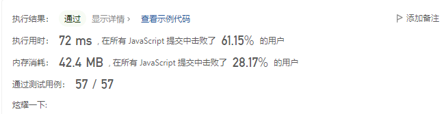

数组

### 题目描述

```
给定一个整数数组 nums 和一个整数目标值 target，请你在该数组中找出 和为目标值 target  的那 两个 整数，并返回它们的数组下标。

你可以假设每种输入只会对应一个答案。但是，数组中同一个元素在答案里不能重复出现。
你可以按任意顺序返回答案。
```

### 示例

输入：nums = [2,7,11,15], target = 9

输出：[0,1]

解释：因为 nums[0] + nums[1] == 9 ，返回 [0, 1] 。

### 提示

- 2 <= nums.length <= 104
- -109 <= nums[i] <= 109
- -109 <= target <= 109
  只会存在一个有效答案

### 思路

因为只会存在一个有效答案，并且只是两数之和，所以这道题目比较简单

#### 暴力解法

暴力解法我们只需要一个双层循环就能解决问题了

```js
var twoSum = function (nums, target) {
  for (let i = 0; i < nums.length; i++) {
    for (let j = i + 1; j < nums.length; j++) {
      if (nums[i] + nums[j] === target) {
        return [i, j];
      }
    }
  }
  return [];
};
```

leetcode 执行结果如下


这样写的时间复杂度是 O(n^2),空间复杂度是 O(1)。

这样的算法虽然是能解决问题的，但是是绝对不可取的。因为随着科技的发展，现在大部分的设备都是性能过剩的。在算法中，有一句话是“时间是最值钱的，空间是最不值钱的”。因为空间我们可以通过加硬盘，更新设备等等手段增加，时间却没有任何办法。

当然找不到好算法解决问题，或者说没啥好思路解决问题，暴力解法也不是不可以

#### 哈希表

利用哈希表的方式就只需要一个 for 循环，我们每遍历一个数字，就在 map 中查询是否存在他与目标值的差值，有就直接返回，没有就存进哈希表继续遍历

```js
var twoSum = function (nums, target) {
  let map = new Map();
  for (let i = 0; i < nums.length; i++) {
    if (map.has(target - nums[i])) {
      return [map.get(target - nums[i]), i];
    }
    map.set(nums[i], i);
  }
  return [];
};
```

代码的时间复杂度 O(n),空间复杂度 O(n)

leetcode 执行结果如下



可以看到执行用时变少了，但是内存消耗变大了
