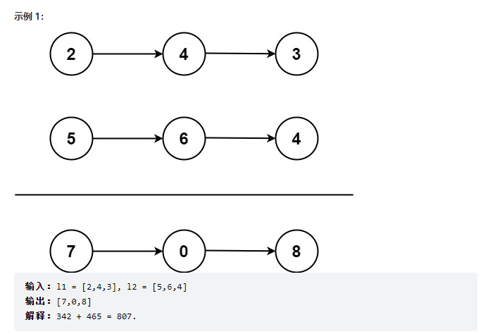

链表

### 题目描述

```
给你两个 非空 的链表，表示两个非负的整数。它们每位数字都是按照 逆序 的方式存储的，并且每个节点只能存储 一位 数字。
请你将两个数相加，并以相同形式返回一个表示和的链表。
你可以假设除了数字 0 之外，这两个数都不会以 0 开头。
```

### 示例



### 提示

- 每个链表中的节点数在范围 [1, 100] 内
- 0 <= Node.val <= 9
- 题目数据保证列表表示的数字不含前导零

### 思路

因为 js 并没有提供给我们链表，所以我们得自己模拟链表 leetcode 也给我们提供了代码

```js
function ListNode(val, next) {
  this.val = val === undefined ? 0 : val;
  this.next = next === undefined ? null : next;
}
```

但是我并不建议，自己在 ide 里面手动写入链表，进行测试，因为太麻烦了，直接在 leetcode 上编译(执行代码)就行了，代码如下(个人理解很主观，选择性接受)

```js
var addTwoNumbers = function (l1, l2) {
  // 准备返回的链表
  let head = null,
    // 中间变量
    tail = null,
    // 储存进位数
    carry = 0;
  // 只要链表一或链表二有一个还存在就继续循环
  while (l1 || l2) {
    // 链表一存在的值，不存在即为0
    const n1 = l1 ? l1.val : 0;
    // 链表二存在的值，不存在即为0
    const n2 = l2 ? l2.val : 0;
    // 当前这个节点的数值和，carry是进位 sum > 10 就进一位
    const sum = n1 + n2 + carry;
    // head刚开始为null
    if (!head) {
      // 给 head tail 创建链表 值为 sum 除以 10 的余数，因为sum可能大于10
      head = tail = new ListNode(sum % 10);
    } else {
      // 如果head已经存在了 我们就直接修改 tail 的val就行了
      tail.next = new ListNode(sum % 10);
      // 节点进1，必须遍历
      tail = tail.next;
    }
    // 进位数 第二轮的时候 carry 会重新赋值 不用担心影响
    carry = Math.floor(sum / 10);
    // l1 存在 节点进 1
    l1 && (l1 = l1.next);
    // l2 存在 节点进 1
    l2 && (l2 = l2.next);
  }
  // 如果最后 carry 还大于 0 就代表溢出了
  // 比如两个长度为3的链表 他们最后一位加起来是 12，那我们最后返回的链表长度肯定为4
  if (carry > 0) {
    tail.next = new ListNode(carry);
  }
  return head;
};
```
