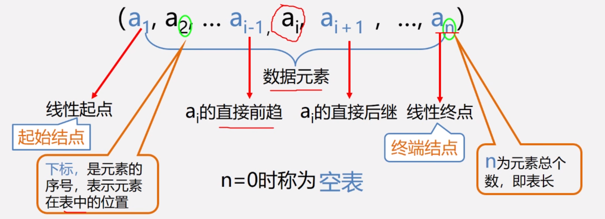
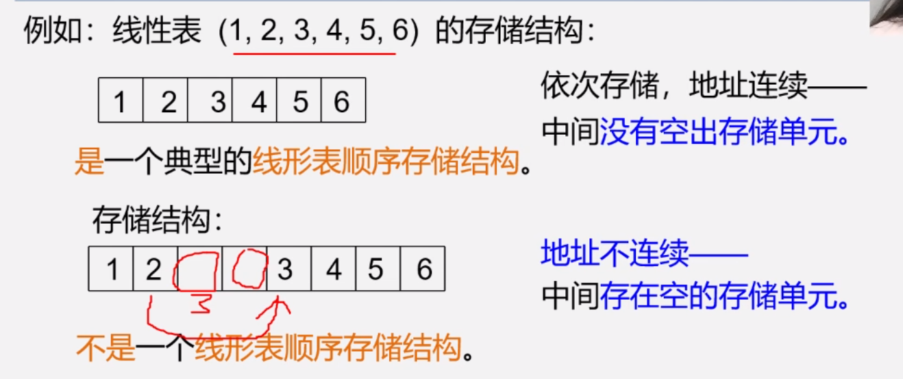

所用语言：C 语言 学习课程:[数据结构与算法基础（青岛大学-王卓）](https://www.bilibili.com/video/BV1nJ411V7bd/?spm_id_from=333.337.search-card.all.click&vd_source=425088ab9830d3bc1e0cb3f50b07aad5)

学习原因：算法依托答辩(悲)

## 第一章 绪论

### 1.1 数据结构的研究内容(略)

### 1.2 基本概念和术语

#### 1.2.1 数据、数据元素、数据项和数据对象

- 数据(Data)
- 数据元素(Data Element)
- 数据项(Data Item)
- 数据对象(Data Object)

- 数据、数据元素、数据项三者的关系
  数据 > 数据元素 > 数据项

#### 1.2.2 数据结构

- 数据结构包括以下三个方面的内容

1. 数据元素之间的逻辑关系，也称为`逻辑结构`
2. 数据元素及其关系在计算机内存中的表示(又称为映像)，称为数据的`物理结构`或数据的`存储结构`
3. 数据的`运算和实现`，即对数据元素可以施加的操作以及这些操作在对应的存储结构上的实现

数据结构的两个层次

1. 逻辑结构

- 描述数据元素之间的逻辑关系
- 与数据的存储无关，独立于计算机
- 是从具体问题抽象出来的数学模型

2. 物理结构(存储结构)

- 数据元素及其关系在计算机存储器中的结构(存储方式)
- 是数据结构在计算机中的表示

**逻辑结构与存储结构的关系**

- 存储结构是逻辑关系的映像与元素本身的映像
- 逻辑结构是数据结构的抽象，存储结构是数据结构的实现
- 两者综合起来建立了数据元素之间的结构关系

**逻辑结构的种类**

划分方法一

(1) 线性结构

有且仅有一个开始和一个终端结点，并且所有结点都最多只有一个直接前趋和一个直接后继。

例如：线性表、栈、队列、串

(2) 非线性结构

一个结点可能有多个直接前趋和直接后继

例如：树、图

**划分方式二————四类基本逻辑结构**

(1) 集合结构: 结构中的数据元素之间除了同属于一个集合的关系外，无任何其它关系。

(2) 线性结构:结构中的数据元素之间存在着一对一的线性关系。

(3) 树形结构:结构中的数据元素之间存在着一对多的层次关系。

(4) 图状结构或网状结构:结构中的数据元素之间存在着多对多的任意关系。

**存储结构的种类**

**四种基本的存储结构:**

- 顺序存储结构
- 链式存储结构
- 索引存储结构
- 散列存储结构

#### 1.2.3 数据类型和抽象数据类型

- 在使用高级程序设计语言编写程序时，必须对程序中出现的每个变量、常量或表达式，明确说明它们所属的数据类型。
  - 例如，C 语言中:
    - 提供 int,char, float, double 等基本数据类型
    - 数组、结构、共用体、枚举等构造数据类型
    - 还有指针、空(void)类型
    - 用户也可用 typedef 自己定义数据类型
- 高级语言中的数据类型明显地或隐含地规定了在程序执行期间变量和表达的所有可能的取值范围，以及在这些数值范围上所允许进行的操作。

  - 例如，C 语言中定义变量 i 为 int 美型，就表示 i 是[-min,max]范围的整数，在这个整数集上可以进行+、-、\ 、\*、\、% 等操作

- 数据类型的作用
  - 约束变量或常量的取值范围。
  - 约束变量或常量的操作。
- 抽象数据类型
  是指一个数学模型以及定义在此数学模型上的一组操
  - 由用户定义,从问题抽象出数据模型（逻辑结构)
  - 还包括定义在数据模型上的一组抽象运算(相关操作)
  - 不考虑计算机内的具体存储结构与运算的具体实现算法
    一个抽象数据类型的`定义格式`如下：

```cpp
ADT 抽象数据类型名 {
  数据对象:<数据对象的定义>
  数据关系:<数据关系的定义>
  基本操作:<基本操作的定义>
} ADT 抽象数据类型名
```

其中：

- 数据对象、数据关系的定义用伪代码描述
- 基本操作的定义格式为：
  - 基本操作名（参数表）
  - 初始条件：（初始条件描述）
  - 操作结果：（操作结果描述）

**基本操作**定义格式说明：

参数表：

- 赋值参数 只为操作提供输入值。
- 引用参数以&打头，除可提供输入值外，还将返回操作结果

初始条件：描述操作执行之前数据结构和参数应满足的条件，若不满足，
则操作失败，并返回相应出错信息，若初始条件为空，则省略之。

操作结果：说明操作正常完成之后，数据结构的变化状况和应返回的结果

抽象数据类型（ADT）定义举例：Circle 的定义

```c
ADT 抽象数据类型名 {
  Data
    数据对象的定义
    数据元素之间逻辑关系的定义
  Operation
    操作 1
      初始条件
      操作结果描述
    操作 2
      .....
    操作 n
      .....
}
```

```c
ADT Circle {
  数据对象：D={r,x,y|r,x,y均为实数}
  数据关系：R={<r,x,y>|r是半径,<x,y>是圆心坐标}
  基本操作：
    Circle(&C,r,x,y)
      操作结果：构造一个圆
    double Area(C)
      初始条件：圆已存在
      操作结果：计算面积
    double Circumference(C)
      初始条件：圆已存在
      操作结果：计算周长
  .....
}ADT  Circle
```

**抽象数据类型(ADT)定义举例：复数的定义**

```c
ADT Complex {
  D = {r1,r2|r1,r2都是实数}
  S = {<r1,r2>|r1是实部,r2是虚部}
  assign(&C,v1,v2)
    初始条件：空的复数C已存在
    操作结果：构造复数C，r1,r2分别被赋以参数v1,v2的值
  destory(&C)
    初始条件：复数C已存在
    操作结果：复数C被销毁
}ADT Complex
```

### 1.3 抽象数据类型的表示与实现


#### 1.3.1 抽象数据类型如何实现

- 抽象数据类型可以通过固有的数据类型(如整形、实型、字符型等)来表示和实现
  - 即利用处理器中已存在的数据类型来说明新的结构，用已经实现的操作来组合新的操作

**`注`：在本门课程的学习过程中，我们使用`类C语言`（介于伪代码和 C 语言之间）作为描述工具。**

#### 1.3.2 用 C 语言真正实现抽象数据类型的定义

- 例如：抽象数据类型"复数"的实现

```c
typedef struct {
  float realpart; /**实部 */
  float imagpart; /**虚部 */
}Complex;          /**定义复数抽象类型 */
```

```c
void assign (Complex * A,float real, float imag) {
  A->realpart = real;/**实部赋值 */
  A->imagpart = imag;/**虚部赋值 */
}
void add(Complex * C, Complex * A, Complex * B) {
  c->realpart = A.realpart + B.realpart;
  c->imagpart = A.imagpart + B.imagpart;
}
```

### 1.4 算法与算法分析


#### 1.4.1 算法的定义

- 对特定问题**求解方法和步骤**的一种描述，它是`指令`的有限`序列`。其中每个指令表示一个或多个操作。

#### 1.4.2 算法的描述

- 自然语言：英文、中文
- 流程图：传统流程图、NS 流程图
- 伪代码：类语言：类 C 语言
- 程序代码：C 语言程序、JAVA 语言程序、js.....

#### 1.4.3 算法与程序

- **算法**是解决问题的一种方法或一个过程，考虑如何将输入转换成输出，一个问题可以有多种算法。
- **程序**是用某种程序设计语言对算法的具体实现

**程序 = 数据结构 + 算法**

- 数据结构通过算法实现操作。
- 算法根据数据结构设计程序

#### 1.4.4 算法特性

**一个算法必须具备以下五个重要特性：**

- **有穷性** 一个算法必须总是在执行有穷步之后结束，且每一步都在有穷时间内完成
- **确定性** 算法中的每一条指令必须有确切的含义，没有二义性，在任何条件下，只有唯一的一条执行路径，即对于相同的输入只能得到相同的输出。
- **可行性** 算法是可以执行的，算法描述的操作可以通过已经实现的基本操作执行有限次来实现。
- **输入** 一个算法有零个或多个输入
- **输出** 一个算法有一个或多个输出

#### 1.4.5 算法设计的要求

- 正确性(Correctness)

  - 算法满足问题要求，能正确解决问题。算法转换为程序要注意：
    1. 程序中**不含语法错误**
    2. 程序对于**几组输入数据**能够得出满足要求的结果
    3. 程序对于**精心选择的、典型、苛刻且带有刁难性**的几组输入程序能够得出满足要求的结果
    4. 程序对于**一切合法的输入数据**都能得出满足要求的结果

  通常以**第三层**意义上的正确性作为衡量一个算法是否合格的标准

- 可读性(Readability)
  - 算法主要是为了人的阅读和交流，其次才是为计算机执行，因此算法应该易于人的理解
  - 另一方面，晦涩难读的算法易于隐藏较多错误而难以调试
- 健壮性(Robustness)
  - 指当**输入非法数据**时，算法恰当的做出反应或静心相应处理，而不是产生莫名其妙的输出结果
  - 处理出错的方法，不应时中断程序的执行，而应是返回一个表示错误或错误性质的值，以便在更高的抽象层次上进行处理
- 高效性(Efficiency)
  - 要求花费尽量少的时间和尽量低的存储需要(时间为主，空间为辅)

#### 1.4.6 算法分析

算法分析的目的是看算法实际是否可行，并在同一问题存在多的算法时可进行性能上的比较，以便从中挑选出比优的算法

- 一个好的算法首先要具备正确性，然后是健壮性，可读性，在几个方面都满足的情况下，主要考虑**算法的效率**，通过算法的效率高低来评判不同算法的优劣程度。
- 算法效率以下两个方面来考虑：

  1. 时间效率：指的是算法所消耗的**时间**；
  2. 空间效率：指的是算法执行过程中所耗费的**存储空间**

  - 时间效率和空间效率有时候是矛盾的

- 算法时间效率的度量
  - 算法时间效率可以用依据该算法编制的程序在计算机上执行**所消耗的时间**来度量
  - 两种度量方法
    - 事后统计
      - 将算法实现，测算其时间和空间开销。
      - 缺点：编写程序实现算法将花费较多的时间和精力；所得实验结果依赖于计算机的软硬件等环境因素，掩盖算法本身的优劣
    - 事前分析
      - 对算法所消耗资源的一种估算方法。

**事前分析方法**

- 一个算法的运行时间是指一个算法在计算机上运行所耗费的时间大致可以等于计算机执行一种简单的操作（如赋值、比较、移动等）所需的**时间**与算法中进行的操作**次数**乘积

  算法运行时间=一个简单操作所需的时间 × 简单操作次数

- 也即算法中每条语句的执行时间之和

算法运行时间 = Σ 每条语句的执行次数 × 该语句执行一次所需的时间

算法运行时间 = Σ 每条语句频度 × 该语句执行一次所需的时间

每条语句执行一次所需的时间，一般是随机器而异的。取决于机器的指令性能、速度以及编译的代码质量。是由机器本身软硬件环境所决定的，它与算法无关。

所以，我们可以**假设执行每条语句所需的时间均为`单位时间`**。此时对算法的运行时间和讨论就可转化为讨论该算法中所有语句的执行次数，即频度之和了。

- 例如：两个 n×n 矩阵相乘的算法可描述为：

```c
for (int i = 1; i <= n; i++) { // n + 1 次
    for (int j = 1; j <= n; j++) { // 执行 n(n+1) 次
        c[i][j] = 0;// 执行 n * n 次
        for (int k = 0; k < n; k++) { // 执行 n*n(n+1)
            c[i][j] = c[i][j] + a[i][k] * b[k][j];// n*n*n 次
        }
    }
}
```

- 为了便于比较不同算法的时间效率，我们仅比较它们的数量级

```c
例如：两个不同的算法，时间消耗分别是：
  T1(n) = 10n^2 与 T2(n) = 5n^3
T1好
```

- 若有某个辅助函数 f(n)，是的当 n 趋近于无穷大时，T(n)/f(n)的极限值为**不等于零的阐述**，则称 f(n)是 T(n)的同数量级函数。记作 T(n)=O(f(n)),称 O(f(n))为**算法的渐进时间复杂度**(O 是数量级的符号)，简称**时间复杂度**

对于求解矩阵相乘问题，算法耗费时间：T(n)=2n^2+3n^2+2n+1

n->∞ 时，T(n)/n^3 -> 2,这表示 n 充分大时，T(n)与 n^3 是同阶或同级数量级，引入大"O"记号，则 T(n)可记作：

T(n)=O(n^3) 这就是求解矩阵相乘问题的**算法渐进时间复杂度**

一般情况下，不必计算所有操作的执行次数，而只考虑算法中**基本操作**执行的次数，它是问题规模 n 的某个函数，用 T(n)表示

算法中基本语句重复执行的次数是问题规模 n 的某个函数 f(n)，算法的时间量度记作：T(n) = O(f(n))

它表示随着 n 的增大，算法执行的时间的增长率和 f(n)的增长率相同，称`渐进时间复杂度`

n 越大算法的执行时间越长

- 排序：n 为记录数
- 矩阵：n 为矩阵的结束
- 多项式：n 为多项式的项目
- 集合：n 为元素个数
- 树：n 为数的节点个数
- 图：n 为图的顶点或边数

#### 1.4.7 分析时间复杂度的基本方法

- 定理 1.1 忽略所有**低次幂和最高次幂系数，体现出增长率的含义**
  - 找出`语句频度最大`的`那条语句`
  - 计算`基本语句`的频度得到问题规模 n 的某个函数 f(n)
  - 取其数量级用符号“O”表示
- 时间复杂度是由嵌套最深层语句的频度所决定的

请注意：有的情况下，算法中基本操作重复执行的次数还随着问题的输入数据集不同而不同

#### 1.4.8 算法时间效率的比较

- 最坏时间复杂度：指在最坏情况下，算法的时间复杂度
- 平均时间复杂度：指在所有可能输入实例在等概率出现的情况下，算法的期望运行时间。
- 最好时间复杂度：指在最好情况下，算法的时间复杂度

- 对于复杂的算法，可以将它们分成几个容易估算的部分，然后利用大 O 加法法则和乘法法则，计算算法的时间复杂度

  - 加法规则 保留最大的
  - 乘法规则 就是乘积

- 当 n 取得最大时，指数时间算法和多项式时间算法在所需时间上非常悬殊
  

#### 1.4.9 渐进空间复杂度

- 空间复杂度：算法所需存储空间得度量

  记作：S(n)=O(f(n))

  其中 n 为问题的规模(或大小)

- 算法要占据的空间
  - 算法本身要占据的空间，输入/输出，指令，阐述，变量等
  - 算法要使用的`辅助空间`

例 将一维数组中的 n 个数逆序存放到原数组中。

```c
O(1)
for (int i = 0; i < n/2; i++) {
    t = a[i];
    a[i] = a[n-i-1];
    a[n-i-1]=t;
}
```

#### 1.4.10 设计好算法的过程


第一章总结


## 第二章 线性表

### 2.1 线性表的定义和特点

**线性表是具有相同特性的数据元素的一个有限序列**


- 线性表(Linear List)：

  由 n(n>=0)个数据元素(结点)a1,a2,...an 组成的有限序列

- 其中数据元素的个数 n 定义为表的长度
- 当 n=0 时称为空表
- 将非空的线性表(n>0)记作：(a1,a2,...an)
- 这里的数据元素 ai(1<=i<=n)只是一个抽象的符号，其具体含义在不同的情况下可以不同。

例 1

```c
  (A,B,C,D,...,Z)
数据元素都是字母； 元素间关系是线性
```

- 线性表的逻辑特征是：
  - 在非空的线性表，有且仅有一个开始节点 a1,他没有直接前趋，而仅有一个直接后趋 a2；
  - 有且仅有一个终端节点 an，它没有直接后继，而仅有一个直接前趋 an-1 和一个直接后继 an-1
    **线性表是一种典型的线性结果**

### 2.2 案例引入

**案例 2.1 一元多项式的运算：实现两个多项式加、减、乘运算**


线性表 P=(P0,P1,P2,...,Pn)

每一项的指数 i 隐含在其系数 Pi 的序号中

**案例 2.2 稀疏多项式的运算**

线性表 A = ((7,0),(3,1),(9.8),(5,17))

线性表 B= ((8,1),(22,7),(-9,8))

- 创建一个新数组 C
- 分别从头遍历比较 a 和 b 的每一项
  - 指数相同，对应系数相加，若其和不为 0，则在 c 中增加一个新项
  - 指数不相同，则将指数较小的项复制到 C 中
- 一个多项式已遍历完毕时，将另一个剩余项依次复制到 c 中即可(数组 c 的大小不定)

- 顺序存储结构存在问题

  - 存储空间分配不灵活
  - 运算的空间复杂度高

**总结**

- 线性表中数据元素的类型可以为简单类型，也可以为复杂类型
- 许多实际应用问题所涉的基本操作有很大相似性，不应为每个具体应用单独编写一个程序
- 从具体应用中抽象出共性的逻辑结构和基本操作（抽象数据类型），然后实现其存储结构和基本功能

### 2.3 线性的类型定义

- 抽象数据类型线性表的定义如下：

```c
ADT List {
  数据对象：D = { ai | ai 属于Element，(i=1,2,...,n,n >= 0)}
  数据关系：R = { < ai-1 ,ai属于D,(i=2,3,...,n)}
  基本操作：
    InitList(&L); DestroyList(&L);
    ListInsert(&L,i,e); ListDelete(&L,i,&e)
    .... 等等
}ADT List
```

**基本操作**

- InitList(&L) (Initialization List)
  - 操作结果：构建一个空的线性表 L
- DestroyList(&L)
  - 初始条件：线性表 L 已经存在
  - 操作结果：销毁线性表 L
- ClearList(&L)
  - 初始条件：线性表 L 已经存在
  - 操作结果：将线性表 L 重置为空表
- ListEmpty(L)
  - 初始条件：线性表 L 已经存在
  - 操作结果：若线性表 L 为空表，则返回 TRUE；否则返回 FALSE
- ListLength(L)
  - 初始条件：线性表 L 已经存在。
  - 操作结果：返回线性表 L 中的数据元素个数。
- GetElem(L,i,&e)
  - 初始条件：线性表 L 已经存在，1<=i<=ListLength(L)
  - 操作结果：用 e 返回线性表 L 中第 i 个数据元素的值
- LocateElem(L,e,compare())
  - 初始条件：线性表 L 已经存在，compare()时数据元素判定函数。
  - 操作结果：返回 L 中第 1 个与 e 满足 compare()的数据元素的位序，若这样的数据元素不存在则返回值为 0。
- PriorElem(L,cur_e,&pre_e)
  - 初始条件：线性表 L 已经存在。
  - 操作结果：若 cur_e 是 L 的数据元素，且不是第一个，则用 pre_e 返回它的前驱，否则操作失败；pre_e 无意义
- NextElem(L,cur_e,&next_e)
  - 初始条件：线性表 L 已经存在
  - 操作结果：若 cur_e 是 L 的数据元素，且不是最后一个，则用 next_e 返回它的后继，否则操作失败，next_e 无意义
- ListInsert(&L,i,e)
  - 初始条件：线性表 L 已经存在，1<=i<=ListLength(L) + 1
  - 操作结果：在 L 的第 i 个位置之前插入新的数据元素 e，L 的长度加一
- ListDelete(&L,i,&e)
  - 初始条件：线性表 L 已经存在，1<=i<=ListLength(L) + 1
  - 操作结果：删除 L 的第 i 个数据元素，并用 e 返回其值，L 的长度减一、
    - 删除前（长度为 n）：(a1,a2,...,ai-1,ai,...,an)
    - 删除后（长度为 n-1）：(a1,a2,...ai-1,ai+1,...,an)
- ListTraverse(&L,visited())
  - 初始条件：线性表 L 已经存在
  - 操作结果：依次对线性表中每个元素调用 visited()
- 以上所提及的运算是逻辑结构上定义的运算。只要给出这些运算的功能是"做什么"，至于"怎么做"等实现细节，只有待确定了存储结构之后才考虑

### 2.4 线性表的顺序表示和实现

- 在计算机内，线性表有两种基本存储结构
  - 顺序存储结构和链式存储结构

线性表的顺序表示又称为顺序存储结构或顺序映像。

顺序存储定义：把逻辑上相邻的数据元素存储在物理上相邻的存储单元中的存储结构

**简而言之，逻辑上相邻，物理上也相邻**


线性表顺序存储结构`占用一片连续的存储空间`。知道某个元素的存储位置就可以计算其他元素的存储位置

线性表的第 1 个数据元素 a1 的存储位置，称作线性表的起始位置或基地址

假设线性表的每个元素需占 l 个存储单元，则 i+1 个数据元素的存储位置和第 i 个数据元素的存储位置之间满足关系：LOC(ai+1) = LOC(ai) + l

**顺序表的特点：以物理位置相邻表示逻辑关系。任一元素均可随机存取(优点)**

顺序表(元素)特点类似数组(元素)：

- 地址连续
- 依次存放
- 随机存取
- 类型相同

用一维数组表示线性表

线性表长可变(插入、删除)，但是数组长度不可动态定义，所以我们用一变量表示顺序表的长度属性

```c
#define LIST_INIT_SIZE 100 // 线性表存储空间的起始分配量
typedef struct {
  ElemType elem[LIST_INIT_SIZE];
  int length; // 当前长度
}SqList;
```

**多项式的顺序存储结构类型定义**

线性表 P = ((p1,e1),(p2,e2),...,(pm,em))

```c
#define MAXSIZE 1000 // 多项式可能达到的最大长度
typedef struct { // 多项式非零项的定义
  float p;       // 系数
  int e;         // 指数
}Ploynomial;
typedef struct {
  Ploynomial *elem; // 存储空间的基地址
  int length;       // 多项式中当前项的个数
}SqList;            // 多项式的顺序存储结构类型为SqList
```

例子：图书表的顺序存储结构类型定义

```c
#define MAXSIZE 10000 // 图书表可能达到的最大长度
typedef struct {// 图书信息定义
  char no[20];    // 图书ISBN
  char name[50];  // 图书名字
  float price;    // 图书价格
}Book;
typedef struct {
  Book *elem; // 存储空间的基地址
  int length; // 图书表中当前图书个数
}SqList；     // 图书表的顺序存储结构类型为SqList
```

### 2 补充(类 C 语言有关操作补充)

#### 元素类型说明

- 顺序表类型定义

```c
typedef struct {
  ElemType data[];
  int length;
}SqList; // 顺序表类型
```

```c
typedef char ElemType
typedef int ElemType
typedef struct {
  ElemType data[MaxSize];
  ElemType *data;
  int length;
}SqList; // 顺序表类型

SqList L;
L.data = (ElemType*)molloc(sizeof(ElemType)*MaxSize)
```

- C 语言的内存动态分配

**需要加载头文件：<stdlib.h\>**

- malloc(m)函数，开辟 m 字节长度的地址空间，并返回这段空间的首地址
- sizeof(x)运算，计算变量 x 的长度
- free(p)函数，释放指针 p 所指变量的存储空间，即彻底删除一个变量
- C++ 的动态存储分配
  - new 类型名 T(初值列表)
    - 功能：申请用于存放 T 类型对象的内存空间，并依初值列表赋以初值结果值
    - 成功：T 类型的指针，指向新分配的内存
    - 失败：0（null）

```cpp
int *p1 = new int;
int *p1 = new int(10)
```

- delete 指针 P
  - 功能：释放指针 P 所指向的内存，P 必须是 new 操作的返回值

```cpp
delete P1
```

- C++中的参数传递
- 函数调用时传送给形参表的实参必须与形参三个一致，类型、个数、顺序
- 参数传递有两种方式

  - 传值方式（参数为整形、实型、字符型等）
  - 传地址
    - 参数为指针变量
    - 参数为引用类型
    - 参数为数组名

- 传值方式
  - 把实参的值传送给函数局部工作区对应的副本中，函数使用这个副本执行必要的功能。函数修改的是副本的值，实参的值不变

```cpp
#include <iostream.h>
void swap(float m,float n){
  float temp;
  temp = m;
  m = n;
  n = temp;
}
void main(){
  float a,b;
  cin>>a>>b;
  swap(a,b)
  cout<<a<<endl<<b<<endl;

}
```

- 传地址方式----指针变量作参数
  - 形参变化影响实参

```cpp
#include <iostream.h>
void swap(float *m,float *n){
  float t;
  t = *m;
  *m = *n;
  *n = t;
}
void main(){
  float a,b,*p1,*p2;
  cin>>a>>b;
  p1=&a;p2=&b;
  swap(p1,p2);
  cout<<a<<endl<<b<<endl;
}
```

- 形参变化不影响实参

```cpp
#include <iostream.h>
void swap(float *m,float *n){
  float *t;
  t = m;
  m = n;
  n = t;
}
void main(){
  float a,b,*p1,*p2;
  cin>>a>>b;
  p1=&a;p2=&b;
  swap(p1,p2);
  cout<<a<<endl<<b<<endl;
}
```

- 数组名作为参数
  - 传递的是数组的首地址
  - 对形参数组所做的任何改变都将放映到实参数组中

```cpp
#include <iostream.h>
void sub(char* b[]){
  b[] = "world";
}
void main(){
  char a[10] = "hello";
  sub(a);
  cout<<a<<endl;
}
```

- 引用类型作参数
  - 引用：它给一个对象提供一个替代的名字。

```cpp
#include<iostream.h>
void main(){
  int i = 5;
  int &j = i;
  i = 7;
  cout<<"i="<<i<<" j="<<j;
}
```

- j 是一个引用类型，代表 i 的一个替代名
- i 值改变时，j 值也跟着改变，所以会输出 i=7 j=7

**引用类型作形参的三点说明**

1. 传递引用给函数与传递指针的效果是一样的，形参变化实参也发生变化。
2. 引用类型作形参，形参与实参就占用不同的存储单元，所以形参变量的值是实参变量的副本。因此，当参数传递的数据量较大时，用引用比用一般变量传递参数的时间和空间效率都好
3. 指针参数虽然也能达到与使用引用的效果，但在被调函数中需要重复使用”\*指针变量名“的形式进行运算，这很容易产生错误且程序的阅读性较差；另一方面，在主调函数的调用点处，必须用变量的地址作为实参

#### 2.4.1 线性表的顺序存储表示

```c
#define MAXSIZE 100
typedef struct {
  ElemType elem [MAXSIZE];
  int length;
}SqList;

typedef struct {
  ElemType *elem;
  int lengthp;
}SqList;// 顺序表类型
L.elem = (ElemType*)malloc(sizeof(ElemType)*MAXSIZE);

SqList L;// 定义变量L，L是SqList这种类型的，L是个顺序表
```

#### 2.4.2 顺序表基本操作的实现

线性表 L 的初始化(参数用引用)

```c
Status InitList_Sq(SqList &L) {   // 构造一个空的顺序表
  L.elem = new ElemType[MAXSIZE]; // 为顺序表分配空间
  if(!l.elem) exit(OVERFLOW);     // 存储分配失败
  L.length = 0;                   // 空表长度为0
  return OK;
}
```

销毁线性表 L

```c
void DestroyList(SqList &L){
  if(L.elem) delete L.elem; // 释放空间
}
```

清空线性表 L

```c
void ClearList(SqList &L){
  L.length = 0;// 将线性表的长度置为0
}
```

求线性表的长度

```c
int GerLength(SqList L){
  return L.length;
}
```

判断线性表 L 是否为空

```c
int IsEmpty(SqList L){
  if(L.length==0) return 1;
  else return 0;
}
```

顺序表的取值

```c
int GetElem(SqList L,int i,ElemType &e) {
  if(i<1||i>L.length) return ERROR;// 判断i值是否合理，若不合理，返回ERROR
  e = L.elem[i-1]; // 第 i-1 的单元存储着第i个数据
  return OK;
}
```

- 按值查找
  - 在线性表 L 中查找与指定值 e 相同的数据元素的位置
  - 从表的一端，逐个进行记录的关键字和给定值的比较，找到，返回该元素的位置序号，未找到，返回 0.

```c
int LocateElem(SqList L,ElemType e){
  // 在线性表L中查找值为e的数据元素，返回其序号（是第几个元素）
  for(i=0;i<L.length;i++){
    if(L.elem[i] == e) return i+1;// 查找成功 返回序号
  }
  return 0 ; // 查找  失败
}
```

- 平均查找长度 ASL(Average Search Length)：
  - 为确定记录在表中的位置，需要与给定值进行比较的关键字的个数的期望值叫做查找算法的平均查找长度

**顺序表的插入**

- 线性表的插入运算是指在表的第 i（1<=i<=n+1）个位置上，插入一个新结点 e，使长度为 n 的线性表（a1,...ai-1,au,...,an）变成长度为`n+1`的线性表(a1,...,ai-1,e,ai,...,an)
  - 算法思想：
    1. 判断插入位置 i 是否合法。
    2. 判断顺序表的存储空间是否已满，若已满返回 ERROR
    3. 将第 n 至第 i 位的元素依次向后移动一个位置，空出第 i 个位置
    4. 将要插入的新元素 e 放入第 i 个位置
    5. 表长+1，插入成功返回 OK

```c
Status ListInsert_Sq(SqList &L,int i,ElemType e){
  if(i<1 || I > L.length + 1) return Error; // i 值不合法
  if(L.length === MAXSIZE) return Error;// 当前存储空间已满
  for(j=L.length - 1; j >= i - 1;j--)
    L.elem[j+1] = L.elem[j];// 插入位置及之后的元素后移
  L.elem[i-1] = e;// 将新元素e放入第 i 个位置
  L.length++;
}
```

- 算法时间主要耗费在移动元素的操作上
  - 若插入在尾节点之后，则根本无需移动（特别快）
  - 若插入在首节点之前，则表中元素全部后移（特别慢）
  - 若要考虑在各种位置插入（共 n + 1 种可能）的平均移动次数，该如何计算 平均 n / 2
  - 时间复杂度 O(n)

**顺序表的删除**

- 线性表的删除算法是指将表的第 i（1<=i<=n）个结点删除，使长度为 n 的线性表(a1,...,ai-1,ai,ai+1,...,an)变成长度为 n-1 的线性表(a1,...ai-1,ai+1,...,an)
  - 算法思想:
    1. 判断删除位置 i 是否合法（合法值为 1<=i<=n）
    2. 将欲删除的元素保留在 e 中。
    3. 将第 i+1 至第 n 位元素依次向前移动一个位置。
    4. 表长减 1，删除成功返回 OK

```c
Status ListDelete_Sq(SqList &L,int i) {
  if((i<1) || (i>L.length)) return ERROR;// i值不合法
  for(j=i;j<=L.length-1;j++)
    L.elem[j-1]=L.elem[j];// 被删除元素之后的元素前移
  L.length--;// 表长减1
  return OK;
}
```

**算法时间同插入算法时间类似**

**顺序表优缺点**

- 优点：
  - 存储密度大（结点本身所占存储量/结点结构所占存储量）
  - 可以随机存取表中任一元素
- 缺点：

  - 在插入、删除某一元素时，需要移动大量元素
  - 浪费存储空间
  - 属于静态存储形式，数据元素的个数不能自由扩充

**克服缺点使用链表 但是优点也无了**

### 2.5 线性表的链式表示和实现

### 2.6 顺序表和链表的比较

### 2.7 线性表的应用

### 2.8 案例分析与实现
