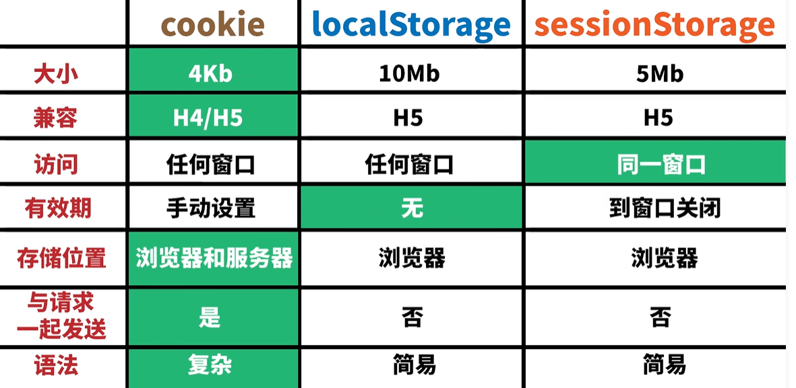

# **html 一些基础知识**

## 1. src 和 href 的异同

**同：**

- 都是 html 标签的属性
- 都可用于引用外部资源

**异：**

- src 用于替换当前元素，比如 img、script、iframe 等等，它指向的资源会下载并应用到文档中
- href 用于建立当前元素或文档与外部资源之间的练习，比如 link、a 等，它指向的资源不会下载，只是创建一个链接或引用。
- 当浏览器遇到 src 时，会暂停其他资源的下载和处理，直接将该资源加载、编译、执行完毕；当浏览器遇到 href 时，会并行下载资源，并且不会停止对当前文档的处理

## 2. 页面导入样式时，使用 link 和@import 有什么区别？

link 和 @import 都是用于导入 css 样式表的方法，但是它们有以下区别

- link 是 html 标签，@import 是 css 语法规则
- link 可以加载 css 文件，也可以定义其它的属性，比如 rss、rel 等；
- link 引入的 css 会同时加载；@import 引入的 css 会等到页面加载。
- link 没有兼容性问题；@import 只能在 IE5+识别(IE 已死，忽略~~~)。
- link 可以通过 JS 操作 DOM 来改变样式；@import 不能

## 3.前端 SEO 优化

SEO 优化主要是为了方便搜索引擎爬取我们页面，提高我们页面的权重所需要做的。

比较常见的有下面这下

- title: 网站的标题
- description: 网站的描述
- keywords: 网站关键词，现代浏览器中作用没那么大了
- 语义化的 HTML 代码，比如：header footer main aside.... 搜索引擎能更容易理解网页
- 图片的 alt：这个很重要，一定要写

注意点

- 重要 HTML 代码放在最前面，比如 meta 标签的 description title 等 就放在 head 里面网页的最上面
- 重要信息不要用 js 输出：爬虫不会执行 js 获取内容
- 少用 iframe：iframe 相当于一个新的 web 页面了，爬虫不会抓取 iframe 的内容
- 提高网站速度：网站速度是搜索引擎排序的重要指标之一，所以现在很多站点都采用 ssr 渲染来提高首屏渲染速度。比如掘金(不过掘金用的 nuxt 是我没想到的)

## 4. 从浏览器地址栏输入一个 URL 地址到浏览器完成渲染的整个过程

简易：

1. 浏览器地址栏输入 URL 并且回车
2. 浏览器进程接受用户输入的 URL，并判断是否是有效的 URL 格式，如果不是，会尝试进行搜索或者提示错误
3. 浏览器进程将 URL 交给网络进程，网络进程进行 DNS 域名解析，找到对应的 IP 地址，简历 TCP 连接
4. 网络进程接受服务器返回的 HTTP 请求，并等待服务器响应。如果请求的协议是 HTTPS，还需要进行 SSL 握手和证书验证。
5. 网络进程接收服务器返回的 HTTP 响应，解析响应头和响应体。如果响应头中国有重定向，缓存等信息，还需要进行相应的处理。
6. 网络进程将响应体中的 HTML 文档传递给渲染进程，渲染进程开始进行页面渲染
7. 渲染进程对 HTML 文档进行解析，构建 DOM 树和 CSSOM 树，并合并成渲染树。
8. 渲染进程对渲染树进行布局，计算每个节点的位置和大小，并生成绘制指令
9. 渲染进程将绘制指令发送给合成线程，合成线程将页面分成多个图层，并调用 GPU 进行绘制和合成
10. 合成线程将合成后的页面显示在屏幕上，完成页面渲染

## 5.img 标签的 title 和 alt 属性

- title 是 HTML 元素的共有属性，用于在鼠标悬浮到元素上时显示相应的提示西悉尼
- alt 是 img 标签的特有属性，用于在图片无法加载时显示图片内容的等价描述，也可以被读屏器阅读
- title 和 alt 的区别是：
  - title 是可选的 alt 是必须的 因为它对于图片的可访问性和 SEO 优化有很大帮助
  - title 旨在鼠标悬浮时显示，alt 只在图片加载失败时显示

## 6.HTML 语义化

HTML 语义化是指使用有一定语义的标签，例如：article header footer main aside p h1 等等 来表示页面结构和内容，而不是 div 一把梭。

HTML 语义化的好处：

- 有利于搜索引擎的建立索引和抓取有效信息，提高网站的排名和流量
- 有利于开发者阅读、维护和写出更优雅的代码、提高代码的可读性和可维护性
- 有利于浏览器、屏幕阅读器等辅助设备解析页面，提高网站的可访问性和用户体验
- 有利于在没有样式 css 情况下也能以一种文档格式显示，便于打印或阅读

## 7.cookies，sessionStorage，localStorage 的区别

- cookie 由服务器端写入，localStorage 和 sessionStorage 由前端写入
- cookie 会参与与服务端的通信，localStorage 和 sessionStorage 不会
- cookie 有失效时间，localStorage 没有，sessionStorage 在页面关闭的时候就被清除
- cookie 一般不超过 4kb，localStorage 和 sessionStorage 可以存储 5M 甚至更多

**经典老图**


## 8.WEB 标准以及 W3C 标准是什么?

- WEB 标准：将结构表现、行为分离，使网页更具有模块化和可维护性。
- W3C 标准时值万维网联盟(W3C)开发的国际 Web 标准，例如 HTML、CSS 标准要求标签字母小写，双标签闭合，标签不随意嵌套等。

## 9.HTML 请求方法用途

但是最常用的就 GET,POST,DELET,PUT(PATCH)，甚至可以 POST 一把梭(但是不建议)

- GET ------ 请求网络指定位置的资源
- POST ------ 向服务器提交数据，请求服务器进行数据处理
- PUT ------ 向网络指定位置上传资源
- DELETE ------ 请求服务器删除 URL 所标识的资源
- HEAD ------ 只请求响应头部，响应体不会返回
- TRACE ------ 回显服务器收到的请求，主要用于测试或诊断
- PATCH ------ 实体中包含一个表，表中说明与该 URI 所表示的原内容的区别
- MOVE ------ 请求服务器将指定的页面移至另一个网络地址
- COPY ------ 请求服务器将指定的页面拷贝至另一个网络地址
- LINK ------ 请求服务器建立链接关系
- UNLINK ------ 断开链接关系

## 10.有哪些 meta viewport 它们分别有什么作用

meta viewport 是一个 HTML 标签，用于控制移动端浏览器的视口大小和缩放行为 1。它可以解决移动端页面在不同设备上的适配问题 2。常用的 meta viewport 属性有以下几种 1：

- width：控制视口的宽度，可以设置为特定像素数或者 device-width（设备宽度）
- height：控制视口的高度，可以设置为特定像素数或者 device-height（设备高度）
- initial-scale：控制页面初始缩放比例，取值范围为 0.0 到 10.0
- maximum-scale：控制页面最大缩放比例，取值范围为 0.0 到 10.0
- minimum-scale：控制页面最小缩放比例，取值范围为 0.0 到 10.0
- user-scalable：控制用户是否可以手动缩放页面，取值为 yes 或 no

```html
<!DOCTYPE html>
<!--H5标准声明，使用 HTML5 doctype，不区分大小写-->
<head lang="”en”">
  <!--标准的 lang 属性写法-->
  <meta charset="’utf-8′" />
  <!--声明文档使用的字符编码-->
  <meta http-equiv="”X-UA-Compatible”" content="”IE" ="edge,chrome" ="1″" />
  <!--优先使用 IE 最新版本和 Chrome-->
  <meta name="”description”" content="”不超过150个字符”" />
  <!--页面描述-->
  <meta name="”keywords”" content="””" />
  <!-- 页面关键词-->
  <meta name="”author”" content="”name," email@gmail.com” />
  <!--网页作者-->
  <meta name="”robots”" content="”index,follow”" />
  <!--搜索引擎抓取-->
  <meta
    name="”viewport”"
    content="”initial-scale"
    ="1,"
    maximum-scale="3,"
    minimum-scale="1,"
    user-scalable="no”"
  />
  <!--为移动设备添加 viewport-->
  <meta name="”apple-mobile-web-app-title”" content="”标题”" />
  <!--iOS 设备 begin-->
  <meta name="”apple-mobile-web-app-capable”" content="”yes”" />
  <!--添加到主屏后的标题（iOS 6 新增）
是否启用 WebApp 全屏模式，删除苹果默认的工具栏和菜单栏-->
  <meta
    name="”apple-itunes-app”"
    content="”app-id"
    ="myAppStoreID,"
    affiliate-data="myAffiliateData,"
    app-argument="myURL”"
  />
  <!--添加智能 App 广告条 Smart App Banner（iOS 6+ Safari）-->
  <meta name="”apple-mobile-web-app-status-bar-style”" content="”black”" />
  <meta name="”format-detection”" content="”telphone" ="no," email="no”" />
  <!--设置苹果工具栏颜色-->
  <meta name="”renderer”" content="”webkit”" />
  <!-- 启用360浏览器的极速模式(webkit)-->
  <meta http-equiv="”X-UA-Compatible”" content="”IE" ="edge”" />
  <!--避免IE使用兼容模式-->
  <meta http-equiv="”Cache-Control”" content="”no-siteapp”" />
  <!--不让百度转码-->
  <meta name="”HandheldFriendly”" content="”true”" />
  <!--针对手持设备优化，主要是针对一些老的不识别viewport的浏览器，比如黑莓-->
  <meta name="”MobileOptimized”" content="”320″" />
  <!--微软的老式浏览器-->
  <meta name="”screen-orientation”" content="”portrait”" />
  <!--uc强制竖屏-->
  <meta name="”x5-orientation”" content="”portrait”" />
  <!--QQ强制竖屏-->
  <meta name="”full-screen”" content="”yes”" />
  <!--UC强制全屏-->
  <meta name="”x5-fullscreen”" content="”true”" />
  <!--QQ强制全屏-->
  <meta name="”browsermode”" content="”application”" />
  <!--UC应用模式-->
  <meta name="”x5-page-mode”" content="”app”" />
  <!-- QQ应用模式-->
  <meta name="”msapplication-tap-highlight”" content="”no”" />
  <!--windows phone 点击无高亮
设置页面不缓存-->
  <meta http-equiv="”pragma”" content="”no-cache”" />
  <meta http-equiv="”cache-control”" content="”no-cache”" />
  <meta http-equiv="”expires”" content="”0″" />
</head>
```

## 11.网页制作会用到的图片格式有哪些？

- JPEG(或 JPG)：最为常见的图片格式，适合存储彩色照片或复杂的图像，支持不同程度的压缩，但会损失一些画质
- PNG：Web 广泛使用的图像格式，支持透明度和无损压缩，但文件大小较大
- GIT：图像动画格式，可以显示多帧动画效果，但颜色数量有限
- WebP：JPG&PNG 最佳替代图像格式，支持无损和有损压缩、透明度和动画效果，文件大小更小
- SVG：可缩放矢量图形格式，适合存储简单的集合形状，文字或图标等，可以任意放大或缩小而不失真。

## 12.web 开发中会话跟踪的方法有哪些

- Cookie：使用 cookie 存储会话的 ID，然后在后续请求中去除 ID 并从服务器上查找会话的相关信息
- URL 重写：在 URL 中附加会话的 ID，然后在后续请求中解析 URL 并从服务器上查找会话的相关信息
- 隐藏表单域：在表单中添加一个隐藏的输入款，用于存储会话的 ID“，然后在提交表单时将 ID 传递给服务器
- HttpSession 对象：使用 HttpSession 对象来存储和管理会话的相关信息，可以设置过期时间和监听器等(个人用得较多)

## 12.(扩展)canvas 指纹追踪技术

canvas 指纹追踪技术是一种基于 HTML5 的用户追踪技术，它利用 canvas 元素来绘制一些图形，并根据用户的浏览器、操作系统、硬件等特征生成一个唯一的指纹。这种指纹可以用来识别和追踪用户的行为，并且很难被阻挡或清除。

canvas 指纹追踪技术的实现步骤大致如下：

- 创建一个不可见的 canvas 元素，并获取其绘图上下文。
- 在 canvas 上绘制一些文字、图形或渐变等
- 调用 toDataURL 方法将 canvas 转换为图片数据
- 对图片数据进行哈希运算，得到一个唯一的字符串，即为 canvas 指纹

使用 canvas 指纹追踪技术的网站或软件有很多，有：

- Facebook
- Google
- Twitter
- Amazon
- Netflix

意义：利用 canvas 指纹来识别和跟踪用户的行为，以提供更个性化的服务或广告

## 13.图片展示方面优化

- 图片懒加载，在页面上的未可视区域可以添加一个滚动事件，判断图片位置与浏览器顶端的距离与页面的距离，如果前者小于后者，优先加载
- 如果为幻灯片、相册等，可以使用图片预加载技术，将当前展示图片的前一张与后一张优先下载
- 如果图片为 css 图片，可以使用`CSSsprite`,`SVSsprite`,`Iconfont`,`Base64`等技术
- 如果图片过大，可以使用特殊编码的图片，加载时会优先加载一张压缩的特别厉害的缩略图，以提高用户体验。
- 如果图片展示区域小于图片的真实大小，则因在服务器端根据业务需要先行进行图片压缩，图片压缩后大小与展示一致

## 14.为什么使用多个域名来存储网站资源会更有效？

这就不得不提 vercel 一个网站给配三个域名的故事了

- `CDN`缓存更方便
- 突破浏览器并发限制
- 节约`cookie`带宽
- 节约主域名的连接数，优化页面响应速度
- 防止不必要的安全问题

## 15.如何进行网站性能优化

- 合并静态资源，减少 HTTP 请求次数
- 压缩代码(打包)
- 使用 CDN，加快资源加载速度
- 使用懒加载，按需加载图片和视频
- 使用 CSS3 动画，减少 JavaScript 开销

## 16.重绘和回流（重排）是什么，应该如何避免？

**概念：**重绘和回流是浏览器渲染页面的两个过程。重绘是指元素的外观发生改变，但不影响布局，如颜色、北京等。回流是指元素的尺寸、位置或结构发生改变，影响布局，如宽高、编剧、插入或删除节点等。

回流比重绘更耗费性能，因为回流会导致整个渲染树的重新计算和构建。回流必定触发重绘，而重绘不一定触发回流

为了避免频繁的重绘和回流，可以采取以下一些方法：

- 尽可能在 DOM 树的最末端改变 class
- 避免设置多层内联样式
- 动画效果应用到 position 属性为 absolute 或 fixed 的元素上
- 避免使用 table 布局
- 使用 css3 硬件加速，可以让 transform、opacity、filters 等动画效果不会引起回流重绘
- 集中改变样式，一次性更改 style 属性或使用 cssText 属性

## 17.CSS3 中的 animation

CSS3 中的 animation 属性是用来创建动画效果的，可以让元素在一段时间内逐渐从一种样式变化成另一种样式。

要使用 animation 属性，首先要定义一个或多个关键帧(@keyframes)，指定元素在不同时间点的样式。

然后，要把 animation 属性绑定到一个选择器上，并指定动画的名称、时长等参数。

animation 属性是一个简写属性，包含了以下六个子属性：

- animation-name：指定动画的名称
- animation-duration：指定动画的时长
- animation-timing-function：指定动画的速度曲线
- animation-delay：指定动画的延迟时间
- animation-iteration-count：指定动画的播放次数
- animation-direction：指定动画的播放方向

例如，以下代码定义了一个名为 myanimation 的动画，让 div 元素在 5s 内从红色变成黄色

```rust
@keyframes myanimation {
  0% {
    background-color: red;
  }
  100% {
    background-color: yellow;
  }
}
div {
  animation: myanimation 5s;
}
```

## 18.HTML 图片懒加载

其实有些浏览器是原生支持图片懒加载的，我们可以通过以下代码来进行判断

```js
if ("loading" in HTMLImageElement.prototype) {
  console.log("支持");
} else {
  console.log("不支持，你可能需要引入懒加载库来实现懒加载");
}
```

如果支持 我们就可以在`img 标签上修改loading属性`

```html


```

## 19.HTTP 和 HTTPS 的区别

**HTTP：**超文本传输协议（HyperText Transfer Protocol HTTP）是互联网上应用最为广泛的一种网络协议。设计 HTTP 最初的目的是为了提供一种发布和接收 HTML 页面的方法。它可以使浏览器更加高效。HTTP 协议是以明文方式发送信息的，如果黑客截取了 Web 浏览器和服务器之间的传输报文，就可以直接获得其中的信息

**HTTP 原理：**

1. 客户端的浏览器首先要通过网络与服务器建立连接，该连接是通过 TCP 来完成的，一般 TCP 连接的端口号是 80.建立连接后，客户机发送一个请求给服务器，请求方式的格式为：统一资源标识符（URI）、协议版本好评，后边是 MIME 信息包括请求装饰符、客户机信息和许可内容。
2. 服务器接到请求后，给予响应的响应信息，其格式为一个状态行，包括信息的协议版本号、一个成功或错误的代码，后边是 MIME 信息包括服务器信息、实体信息和可能的内容。

HTTPS：是以安全为目标的 HTTP 通道，是 HTTP 的安全版。HTTPS 的安全基础是 SSL。SSL 协议位于 TEC/IP 协议与各种应用协议之间，为数据通讯提供安全支持。SSL 协议可分为两层：SSL 记录协议（SSL Record Protocol），它建立在可靠的传输协议（如 TCP）之上，为高层协议提供数据封装、压缩、加密等基本功能的支持。SSL 握手协议（SSL Handshake Protocol），它建立在 SSL 记录协议之上，用于在实际的数据传输开始前，通讯双方进行身份认证、协商加密算法、交换加密密钥等。

**HTTPS 设置目标：**

1. 数据保密性：保证数据内容在传输的过程中不会被第三方查看。就像快递员传递包裹一样，都进行了封装，别人无法获知里面装了什么。
2. 数据完整性：及时发现被第三方篡改的传输内容。就像快递员虽然不知道包裹里装了什么东西，但他有可能中途掉包，数据完整性就是指如果被掉包，我们能轻松发现并拒收。
3. 身份校验安全性：保证数据到达用户期望的目的地。就像我们邮寄包裹时，虽然是一个封装好的未掉包的包裹，但必须确定这个包裹不会送错地方，通过身份校验来确保送对了地方。

**HTTP 和 HTTPS 的区别**

- HTTPS 协议需要到 CA（Certificate Authority，整数颁发机构）申请整数，一般免费整数较少，因而需要一定费用。（以前的网易官网是 http，而网易邮箱是 https）
- HTTP 是超文本传输协议，信息是明文传输，HTTPS 则是具有安全性的 SSL 加密传输协议。
- HTTP 和 HTTPS 使用的是完全不同的连接方式，用的端口号也不一样，前者是 80，后者是 443
- HTTP 的连接很简单，是无状态的。HTTPS 协议是由 SSL+HTTP 协议构建的可进行加密传输、身份认证的网络协议，比 HTTP 协议安全。（无状态的意思是其数据包的发送、传输和接收都是相互独立的。无连接的意思是指通信双方都不长久的维持对方的任何信息。）

## 20.什么是跨域问题？为什么有跨域问题？如何解决？

跨域问题源于浏览器的同源策略限制。

**浏览器同源策略：主要是限制 cookie 的访问，在非同源的情况下，A 网页不能够访问 B 网页，“同源”即是 协议 + 域名 + 端口 都得完全一致**

同源的设计是为了防止 CSRF（跨站请求伪造），例如，你登录了一个网站 A，本地存储了你的 cookie，没有同源策略的话，B 网站也能拿到那个 cookie，然后用来模拟你的身份进行一系列操作。

随着互联网的发展，同源策略越来越严格，不仅限于 cookie 的读取

- cookie、LocalStorage 和 IndexDB 无法读取
- DOM 无法获取
- 请求的响应会被拦截

**解决方法**

- 前端解决
  - JSONP（缺陷，只能发送 get 请求）
  - 配置代理
    - 一般就开发阶段使用，原理是每次请求发出前改写请求头
- 后端解决
  - CORS 后端设置允许访问的请求头
    - 一般开发环境设置通配符允许所有来源请求
    - 生产环境就只允许部署的域名或 IP + 端口的来源请求
- 运维解决？
  - nginx 反向代理
