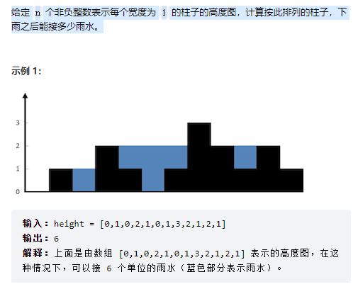

### 题目描述

给定 n 个非负整数表示每个宽度为 1 的柱子的高度图，计算按此排列的柱子，下雨之后能接多少雨水。

### 示例



### 思路

动态规划

```js
var trap = function (height) {
  // 获得横向有多少列
  const n = height.length;
  // 如果等于0那就直接返回0
  if (n === 0) {
    return 0;
  }
  // 左边的最大高度
  const leftMax = new Array(n).fill(0);
  // 第一项就是传入的第一项
  leftMax[0] = height[0];
  // 填入height左边的一项与当前项中最大值
  for (let i = 1; i < n; ++i) {
    leftMax[i] = Math.max(leftMax[i - 1], height[i]);
  }
  // 右边的最大值
  const rightMax = new Array(n).fill(0);
  // 末尾位是传入的末尾位
  rightMax[n - 1] = height[n - 1];
  // 填入height右边的一项与当前项中的最大值
  for (let i = n - 2; i >= 0; --i) {
    rightMax[i] = Math.max(rightMax[i + 1], height[i]);
  }
  // 返回值
  let ans = 0;
  // 求左右最大值数组的最小值与height当前值的差
  for (let i = 0; i < n; ++i) {
    ans += Math.min(leftMax[i], rightMax[i]) - height[i];
  }
  return ans;
};
```

双指针

```js
var trap = function (height) {
  let ans = 0;
  let left = 0,
    right = height.length - 1;
  let leftMax = 0,
    rightMax = 0;
  while (left < right) {
    leftMax = Math.max(leftMax, height[left]);
    rightMax = Math.max(rightMax, height[right]);
    if (height[left] < height[right]) {
      ans += leftMax - height[left];
      ++left;
    } else {
      ans += rightMax - height[right];
      --right;
    }
  }
  return ans;
};
```
